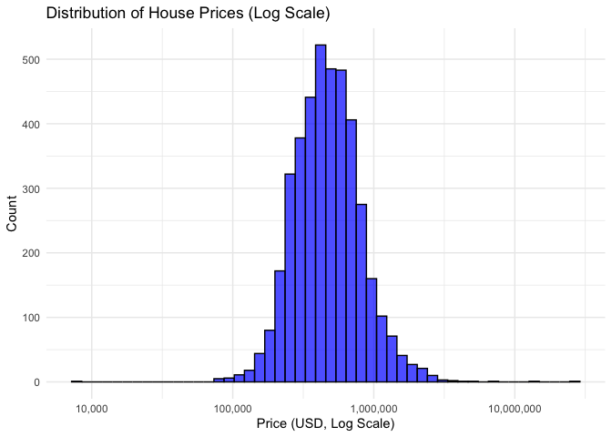
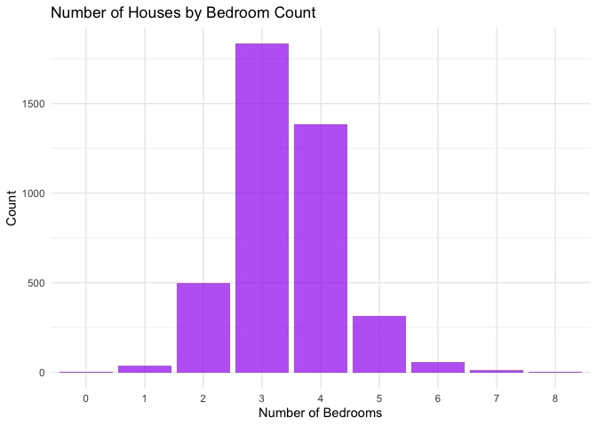
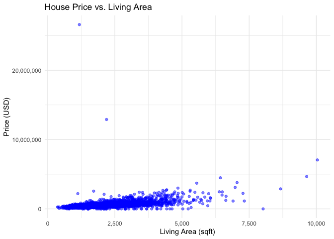

README
================

## Download Dataset

``` r
# Define the download URL
kaggle_url <- "https://www.kaggle.com/api/v1/datasets/download/fratzcan/usa-house-prices"

# Define the output file path
output_file <- file.path("./", "usa-house-prices.zip")

# Run the cURL command in R
system(paste("curl -L -o", shQuote(output_file), shQuote(kaggle_url)))

# Optional: Unzip the file
unzip(output_file, exdir = "./usa-house-prices")

# Confirm download
list.files("~/Downloads/usa-house-prices")
```

    ## character(0)

## Understanding the Data

#### When was the data acquired?

This data was gathered over the period from 2014-05-02 to 2014-07-10. It was uploaded on to Kaggle July 21, 2024 and most recently updated in September, 2024. The data was accessed from Kaggle on February 13, 2025.

#### Where was the data acquired?

The data used in this report was accessed via Kaggle.com. The Kaggle link was uploaded via the Moodle.com platform at a small liberal arts college.

#### How was the data acquired?

The data was collected and uploaded via the Kaggle.com user Firat Ozcan. It extracts data from the USA housing market and extrapolates it to Kaggle.com via a .csv file. Kaggle is a data science platform and online community for data scientists and machine learning practitioners under Google LLC.

#### What are the attributes of this dataset?

The features of the dataset are displayed on the data card in kaggle.com. There are 18 features (Date, price, bedrooms, bathrooms, sqft living, sqf loft, floors, waterfront, view, conditons, sqft above, sqft basement, year built, year renovated, street, city, statezip, country) that will be analyzed. Below is R script code that loads the USA Housing Dataset and creates a data dictionary table based on the descriptions provided on Kaggle.

``` r
#install.packages("readr")   # For reading CSV files
#install.packages("dplyr")   # For data manipulation
#install.packages("knitr")   # For creating a table
#install.packages("kableExtra") # For formatting tables
#install.packages("scales") 
library(scales)
library(readr)
```

    ## 
    ## Attaching package: 'readr'

    ## The following object is masked from 'package:scales':
    ## 
    ##     col_factor

``` r
library(dplyr)
```

    ## 
    ## Attaching package: 'dplyr'

    ## The following objects are masked from 'package:stats':
    ## 
    ##     filter, lag

    ## The following objects are masked from 'package:base':
    ## 
    ##     intersect, setdiff, setequal, union

``` r
library(knitr)
library(kableExtra)
```

    ## 
    ## Attaching package: 'kableExtra'

    ## The following object is masked from 'package:dplyr':
    ## 
    ##     group_rows

``` r
# Load the dataset (update the path if needed)
dataset <- read_csv("~/Downloads/USA_Housing_Dataset.csv")
```

    ## Rows: 4140 Columns: 18

    ## ── Column specification ────────────────────────────────────────────────────────
    ## Delimiter: ","
    ## chr   (4): street, city, statezip, country
    ## dbl  (13): price, bedrooms, bathrooms, sqft_living, sqft_lot, floors, waterf...
    ## dttm  (1): date
    ## 
    ## ℹ Use `spec()` to retrieve the full column specification for this data.
    ## ℹ Specify the column types or set `show_col_types = FALSE` to quiet this message.

``` r
# View first few rows
head(dataset)
```

    ## # A tibble: 6 × 18
    ##   date                  price bedrooms bathrooms sqft_living sqft_lot floors
    ##   <dttm>                <dbl>    <dbl>     <dbl>       <dbl>    <dbl>  <dbl>
    ## 1 2014-05-09 00:00:00  376000        3      2           1340     1384      3
    ## 2 2014-05-09 00:00:00  800000        4      3.25        3540   159430      2
    ## 3 2014-05-09 00:00:00 2238888        5      6.5         7270   130017      2
    ## 4 2014-05-09 00:00:00  324000        3      2.25         998      904      2
    ## 5 2014-05-10 00:00:00  549900        5      2.75        3060     7015      1
    ## 6 2014-05-10 00:00:00  320000        3      2.5         2130     6969      2
    ## # ℹ 11 more variables: waterfront <dbl>, view <dbl>, condition <dbl>,
    ## #   sqft_above <dbl>, sqft_basement <dbl>, yr_built <dbl>, yr_renovated <dbl>,
    ## #   street <chr>, city <chr>, statezip <chr>, country <chr>

``` r
# Define the updated data dictionary with correct types and levels of measurement
data_dictionary <- tibble::tibble(
  Variable = c("Price", "Bedrooms", "Bathrooms", "Sqft Living", "Sqft Lot", 
               "Floors", "Waterfront", "View", "Condition", "Sqft Above", 
               "Sqft Basement", "Yr Built", "Yr Renovated", "Street", 
               "City", "StateZip", "Country", 
               "Median Area Income", "Median Area House Age", 
               "Median Area Number of Rooms", "Median Area Number of Bedrooms", "Area Population"),
  Type = c("Ratio", "Ratio", "Ratio", "Ratio", "Ratio", 
           "Ratio", "Nominal", "Ordinal", "Ordinal", "Ratio", 
           "Ratio", "Interval", "Interval", "Nominal", 
           "Nominal", "Nominal", "Nominal", 
           "Ratio", "Ratio", 
           "Ratio", "Ratio", "Ratio"),
  Description = c("Sale price of the house (in USD).",
                  "Number of bedrooms in the house.",
                  "Number of bathrooms in the house.",
                  "Total living area in square feet.",
                  "Total lot size in square feet.",
                  "Number of floors in the house.",
                  "Indicates if the house is on the waterfront (Yes/No).",
                  "A rating of the house's view quality.",
                  "Condition of the house (1-5 scale, where 5 is the best).",
                  "Square footage of the house above ground.",
                  "Square footage of the basement.",
                  "Year the house was built.",
                  "Year the house was last renovated.",
                  "Street address of the house.",
                  "City where the house is located.",
                  "State and ZIP code of the house.",
                  "Country where the house is located.",
                  "Median income of residents in the area (in USD).",
                  "Median age of houses in the area.",
                  "Median number of rooms in houses in the area.",
                  "Median number of bedrooms in houses in the area.",
                  "Population of the area.")
)
# Print the data dictionary as a formatted table
data_dictionary %>%
  kable("pipe") %>%
  kable_styling(full_width = FALSE, bootstrap_options = c("striped", "hover"))
```

<table class="table table-striped table-hover" style="width: auto !important; margin-left: auto; margin-right: auto;">
<thead>
<tr>
<th style="text-align:left;">
Variable
</th>
<th style="text-align:left;">
Type
</th>
<th style="text-align:left;">
Description
</th>
</tr>
</thead>
<tbody>
<tr>
<td style="text-align:left;">
Price
</td>
<td style="text-align:left;">
Ratio
</td>
<td style="text-align:left;">
Sale price of the house (in USD).
</td>
</tr>
<tr>
<td style="text-align:left;">
Bedrooms
</td>
<td style="text-align:left;">
Ratio
</td>
<td style="text-align:left;">
Number of bedrooms in the house.
</td>
</tr>
<tr>
<td style="text-align:left;">
Bathrooms
</td>
<td style="text-align:left;">
Ratio
</td>
<td style="text-align:left;">
Number of bathrooms in the house.
</td>
</tr>
<tr>
<td style="text-align:left;">
Sqft Living
</td>
<td style="text-align:left;">
Ratio
</td>
<td style="text-align:left;">
Total living area in square feet.
</td>
</tr>
<tr>
<td style="text-align:left;">
Sqft Lot
</td>
<td style="text-align:left;">
Ratio
</td>
<td style="text-align:left;">
Total lot size in square feet.
</td>
</tr>
<tr>
<td style="text-align:left;">
Floors
</td>
<td style="text-align:left;">
Ratio
</td>
<td style="text-align:left;">
Number of floors in the house.
</td>
</tr>
<tr>
<td style="text-align:left;">
Waterfront
</td>
<td style="text-align:left;">
Nominal
</td>
<td style="text-align:left;">
Indicates if the house is on the waterfront (Yes/No).
</td>
</tr>
<tr>
<td style="text-align:left;">
View
</td>
<td style="text-align:left;">
Ordinal
</td>
<td style="text-align:left;">
A rating of the house’s view quality.
</td>
</tr>
<tr>
<td style="text-align:left;">
Condition
</td>
<td style="text-align:left;">
Ordinal
</td>
<td style="text-align:left;">
Condition of the house (1-5 scale, where 5 is the best).
</td>
</tr>
<tr>
<td style="text-align:left;">
Sqft Above
</td>
<td style="text-align:left;">
Ratio
</td>
<td style="text-align:left;">
Square footage of the house above ground.
</td>
</tr>
<tr>
<td style="text-align:left;">
Sqft Basement
</td>
<td style="text-align:left;">
Ratio
</td>
<td style="text-align:left;">
Square footage of the basement.
</td>
</tr>
<tr>
<td style="text-align:left;">
Yr Built
</td>
<td style="text-align:left;">
Interval
</td>
<td style="text-align:left;">
Year the house was built.
</td>
</tr>
<tr>
<td style="text-align:left;">
Yr Renovated
</td>
<td style="text-align:left;">
Interval
</td>
<td style="text-align:left;">
Year the house was last renovated.
</td>
</tr>
<tr>
<td style="text-align:left;">
Street
</td>
<td style="text-align:left;">
Nominal
</td>
<td style="text-align:left;">
Street address of the house.
</td>
</tr>
<tr>
<td style="text-align:left;">
City
</td>
<td style="text-align:left;">
Nominal
</td>
<td style="text-align:left;">
City where the house is located.
</td>
</tr>
<tr>
<td style="text-align:left;">
StateZip
</td>
<td style="text-align:left;">
Nominal
</td>
<td style="text-align:left;">
State and ZIP code of the house.
</td>
</tr>
<tr>
<td style="text-align:left;">
Country
</td>
<td style="text-align:left;">
Nominal
</td>
<td style="text-align:left;">
Country where the house is located.
</td>
</tr>
<tr>
<td style="text-align:left;">
Median Area Income
</td>
<td style="text-align:left;">
Ratio
</td>
<td style="text-align:left;">
Median income of residents in the area (in USD).
</td>
</tr>
<tr>
<td style="text-align:left;">
Median Area House Age
</td>
<td style="text-align:left;">
Ratio
</td>
<td style="text-align:left;">
Median age of houses in the area.
</td>
</tr>
<tr>
<td style="text-align:left;">
Median Area Number of Rooms
</td>
<td style="text-align:left;">
Ratio
</td>
<td style="text-align:left;">
Median number of rooms in houses in the area.
</td>
</tr>
<tr>
<td style="text-align:left;">
Median Area Number of Bedrooms
</td>
<td style="text-align:left;">
Ratio
</td>
<td style="text-align:left;">
Median number of bedrooms in houses in the area.
</td>
</tr>
<tr>
<td style="text-align:left;">
Area Population
</td>
<td style="text-align:left;">
Ratio
</td>
<td style="text-align:left;">
Population of the area.
</td>
</tr>
</tbody>
</table>

## Summary Statistics

Now we can take a further look at the data to gain initial insights and have an overview of the statistics. We can do this by performing a basic Exploratory Data Analysis (EDA). The code below will display the summary statistics from the dataset.

``` r
# Install required packages (if not already installed)
#install.packages("readr")      
#install.packages("dplyr")      
#install.packages("ggplot2")    
#install.packages("skimr")      
#install.packages("modeest")    
#install.packages("scales")  # For formatting large numbers
#install.packages("knitr")
# Load libraries
library(readr)
library(dplyr)
library(ggplot2)
library(skimr)
library(modeest)
library(scales)  # New package to format numbers
library(knitr)
# Load the dataset (update the path if needed)
dataset <- read_csv("~/Downloads/USA_Housing_Dataset.csv")
```

    ## Rows: 4140 Columns: 18
    ## ── Column specification ────────────────────────────────────────────────────────
    ## Delimiter: ","
    ## chr   (4): street, city, statezip, country
    ## dbl  (13): price, bedrooms, bathrooms, sqft_living, sqft_lot, floors, waterf...
    ## dttm  (1): date
    ## 
    ## ℹ Use `spec()` to retrieve the full column specification for this data.
    ## ℹ Specify the column types or set `show_col_types = FALSE` to quiet this message.

``` r
# Check structure of dataset
str(dataset)
```

    ## spc_tbl_ [4,140 × 18] (S3: spec_tbl_df/tbl_df/tbl/data.frame)
    ##  $ date         : POSIXct[1:4140], format: "2014-05-09" "2014-05-09" ...
    ##  $ price        : num [1:4140] 376000 800000 2238888 324000 549900 ...
    ##  $ bedrooms     : num [1:4140] 3 4 5 3 5 3 4 4 3 4 ...
    ##  $ bathrooms    : num [1:4140] 2 3.25 6.5 2.25 2.75 2.5 2 1 2.5 2.5 ...
    ##  $ sqft_living  : num [1:4140] 1340 3540 7270 998 3060 2130 2520 1940 1350 2160 ...
    ##  $ sqft_lot     : num [1:4140] 1384 159430 130017 904 7015 ...
    ##  $ floors       : num [1:4140] 3 2 2 2 1 2 1 1 3 2.5 ...
    ##  $ waterfront   : num [1:4140] 0 0 0 0 0 0 0 0 0 0 ...
    ##  $ view         : num [1:4140] 0 0 0 0 0 0 0 0 0 0 ...
    ##  $ condition    : num [1:4140] 3 3 3 3 5 3 3 3 3 4 ...
    ##  $ sqft_above   : num [1:4140] 1340 3540 6420 798 1600 2130 1400 1080 1270 2160 ...
    ##  $ sqft_basement: num [1:4140] 0 0 850 200 1460 0 1120 860 80 0 ...
    ##  $ yr_built     : num [1:4140] 2008 2007 2010 2007 1979 ...
    ##  $ yr_renovated : num [1:4140] 0 0 0 0 0 ...
    ##  $ street       : chr [1:4140] "9245-9249 Fremont Ave N" "33001 NE 24th St" "7070 270th Pl SE" "820 NW 95th St" ...
    ##  $ city         : chr [1:4140] "Seattle" "Carnation" "Issaquah" "Seattle" ...
    ##  $ statezip     : chr [1:4140] "WA 98103" "WA 98014" "WA 98029" "WA 98117" ...
    ##  $ country      : chr [1:4140] "USA" "USA" "USA" "USA" ...
    ##  - attr(*, "spec")=
    ##   .. cols(
    ##   ..   date = col_datetime(format = ""),
    ##   ..   price = col_double(),
    ##   ..   bedrooms = col_double(),
    ##   ..   bathrooms = col_double(),
    ##   ..   sqft_living = col_double(),
    ##   ..   sqft_lot = col_double(),
    ##   ..   floors = col_double(),
    ##   ..   waterfront = col_double(),
    ##   ..   view = col_double(),
    ##   ..   condition = col_double(),
    ##   ..   sqft_above = col_double(),
    ##   ..   sqft_basement = col_double(),
    ##   ..   yr_built = col_double(),
    ##   ..   yr_renovated = col_double(),
    ##   ..   street = col_character(),
    ##   ..   city = col_character(),
    ##   ..   statezip = col_character(),
    ##   ..   country = col_character()
    ##   .. )
    ##  - attr(*, "problems")=<externalptr>

``` r
# Basic summary statistics without scientific notation
summary_stats <- summary(dataset)
# Format numeric values to remove scientific notation
formatted_summary <- as.data.frame(summary_stats) %>% mutate_all(~ format(., big.mark = ",", scientific = FALSE))
# Print formatted summary statistics as a Markdown table
kable(formatted_summary, caption = "Summary Statistics for Dataset", format = "markdown")
```

| Var1 | Var2          | Freq                           |
|:-----|:--------------|:-------------------------------|
|      | date          | Min. :2014-05-02 00:00:00.00   |
|      | date          | 1st Qu.:2014-05-27 00:00:00.00 |
|      | date          | Median :2014-06-12 00:00:00.00 |
|      | date          | Mean :2014-06-10 16:24:41.74   |
|      | date          | 3rd Qu.:2014-06-25 00:00:00.00 |
|      | date          | Max. :2014-07-10 00:00:00.00   |
|      | price         | Min. : 0                       |
|      | price         | 1st Qu.: 320000                |
|      | price         | Median : 460000                |
|      | price         | Mean : 553063                  |
|      | price         | 3rd Qu.: 659125                |
|      | price         | Max. :26590000                 |
|      | bedrooms      | Min. :0.0                      |
|      | bedrooms      | 1st Qu.:3.0                    |
|      | bedrooms      | Median :3.0                    |
|      | bedrooms      | Mean :3.4                      |
|      | bedrooms      | 3rd Qu.:4.0                    |
|      | bedrooms      | Max. :8.0                      |
|      | bathrooms     | Min. :0.000                    |
|      | bathrooms     | 1st Qu.:1.750                  |
|      | bathrooms     | Median :2.250                  |
|      | bathrooms     | Mean :2.163                    |
|      | bathrooms     | 3rd Qu.:2.500                  |
|      | bathrooms     | Max. :6.750                    |
|      | sqft_living   | Min. : 370                     |
|      | sqft_living   | 1st Qu.: 1470                  |
|      | sqft_living   | Median : 1980                  |
|      | sqft_living   | Mean : 2144                    |
|      | sqft_living   | 3rd Qu.: 2620                  |
|      | sqft_living   | Max. :10040                    |
|      | sqft_lot      | Min. : 638                     |
|      | sqft_lot      | 1st Qu.: 5000                  |
|      | sqft_lot      | Median : 7676                  |
|      | sqft_lot      | Mean : 14698                   |
|      | sqft_lot      | 3rd Qu.: 11000                 |
|      | sqft_lot      | Max. :1074218                  |
|      | floors        | Min. :1.000                    |
|      | floors        | 1st Qu.:1.000                  |
|      | floors        | Median :1.500                  |
|      | floors        | Mean :1.514                    |
|      | floors        | 3rd Qu.:2.000                  |
|      | floors        | Max. :3.500                    |
|      | waterfront    | Min. :0.000000                 |
|      | waterfront    | 1st Qu.:0.000000               |
|      | waterfront    | Median :0.000000               |
|      | waterfront    | Mean :0.007488                 |
|      | waterfront    | 3rd Qu.:0.000000               |
|      | waterfront    | Max. :1.000000                 |
|      | view          | Min. :0.0000                   |
|      | view          | 1st Qu.:0.0000                 |
|      | view          | Median :0.0000                 |
|      | view          | Mean :0.2466                   |
|      | view          | 3rd Qu.:0.0000                 |
|      | view          | Max. :4.0000                   |
|      | condition     | Min. :1.000                    |
|      | condition     | 1st Qu.:3.000                  |
|      | condition     | Median :3.000                  |
|      | condition     | Mean :3.452                    |
|      | condition     | 3rd Qu.:4.000                  |
|      | condition     | Max. :5.000                    |
|      | sqft_above    | Min. : 370                     |
|      | sqft_above    | 1st Qu.:1190                   |
|      | sqft_above    | Median :1600                   |
|      | sqft_above    | Mean :1831                     |
|      | sqft_above    | 3rd Qu.:2310                   |
|      | sqft_above    | Max. :8020                     |
|      | sqft_basement | Min. : 0.0                     |
|      | sqft_basement | 1st Qu.: 0.0                   |
|      | sqft_basement | Median : 0.0                   |
|      | sqft_basement | Mean : 312.3                   |
|      | sqft_basement | 3rd Qu.: 602.5                 |
|      | sqft_basement | Max. :4820.0                   |
|      | yr_built      | Min. :1900                     |
|      | yr_built      | 1st Qu.:1951                   |
|      | yr_built      | Median :1976                   |
|      | yr_built      | Mean :1971                     |
|      | yr_built      | 3rd Qu.:1997                   |
|      | yr_built      | Max. :2014                     |
|      | yr_renovated  | Min. : 0.0                     |
|      | yr_renovated  | 1st Qu.: 0.0                   |
|      | yr_renovated  | Median : 0.0                   |
|      | yr_renovated  | Mean : 808.4                   |
|      | yr_renovated  | 3rd Qu.:1999.0                 |
|      | yr_renovated  | Max. :2014.0                   |
|      | street        | Length:4140                    |
|      | street        | Class :character               |
|      | street        | Mode :character                |
|      | street        | NA                             |
|      | street        | NA                             |
|      | street        | NA                             |
|      | city          | Length:4140                    |
|      | city          | Class :character               |
|      | city          | Mode :character                |
|      | city          | NA                             |
|      | city          | NA                             |
|      | city          | NA                             |
|      | statezip      | Length:4140                    |
|      | statezip      | Class :character               |
|      | statezip      | Mode :character                |
|      | statezip      | NA                             |
|      | statezip      | NA                             |
|      | statezip      | NA                             |
|      | country       | Length:4140                    |
|      | country       | Class :character               |
|      | country       | Mode :character                |
|      | country       | NA                             |
|      | country       | NA                             |
|      | country       | NA                             |

Summary Statistics for Dataset

``` r
# Additional summary statistics using skimr (without scientific notation)
skimmed_data <- skim(dataset)
# Function to remove scientific notation in skimr output
format_skim <- function(x) {
  if (is.numeric(x)) {
    return(format(x, big.mark = ",", scientific = FALSE))
  } else {
    return(x)
  }
}
# Apply formatting
skimmed_data <- skimmed_data %>%
  mutate(across(where(is.numeric), format_skim))
# Print formatted skimmed statistics as a Markdown table
kable(skimmed_data, caption = "Skim Summary Statistics for Dataset", format = "markdown")
```

| skim_type | skim_variable | n_missing | complete_rate | POSIXct.min | POSIXct.max | POSIXct.median | POSIXct.n_unique | character.min | character.max | character.empty | character.n_unique | character.whitespace | numeric.mean | numeric.sd | numeric.p0 | numeric.p25 | numeric.p50 | numeric.p75 | numeric.p100 | numeric.hist |
|:---|:---|:---|:---|:---|:---|:---|:---|:---|:---|:---|:---|:---|:---|:---|:---|:---|:---|:---|:---|:---|
| POSIXct | date | 0 | 1 | 2014-05-02 | 2014-07-10 | 2014-06-12 | 68 | NA | NA | NA | NA | NA | NA | NA | NA | NA | NA | NA | NA | NA |
| character | street | 0 | 1 | NA | NA | NA | NA | 8 | 46 | 0 | 4,079 | 0 | NA | NA | NA | NA | NA | NA | NA | NA |
| character | city | 0 | 1 | NA | NA | NA | NA | 4 | 18 | 0 | 43 | 0 | NA | NA | NA | NA | NA | NA | NA | NA |
| character | statezip | 0 | 1 | NA | NA | NA | NA | 8 | 8 | 0 | 77 | 0 | NA | NA | NA | NA | NA | NA | NA | NA |
| character | country | 0 | 1 | NA | NA | NA | NA | 3 | 3 | 0 | 1 | 0 | NA | NA | NA | NA | NA | NA | NA | NA |
| numeric | price | 0 | 1 | NA | NA | NA | NA | NA | NA | NA | NA | NA | 553,062.877289078 | 583,686.45224462 | 0 | 320,000.00 | 460,000.00 | 659,125.0 | 26,590,000.00 | ▇▁▁▁▁ |
| numeric | bedrooms | 0 | 1 | NA | NA | NA | NA | NA | NA | NA | NA | NA | 3.400483092 | 0.90393880 | 0 | 3.00 | 3.00 | 4.0 | 8.00 | ▁▇▅▁▁ |
| numeric | bathrooms | 0 | 1 | NA | NA | NA | NA | NA | NA | NA | NA | NA | 2.163043478 | 0.78473302 | 0 | 1.75 | 2.25 | 2.5 | 6.75 | ▂▇▂▁▁ |
| numeric | sqft_living | 0 | 1 | NA | NA | NA | NA | NA | NA | NA | NA | NA | 2,143.638888889 | 957.48162104 | 370 | 1,470.00 | 1,980.00 | 2,620.0 | 10,040.00 | ▇▅▁▁▁ |
| numeric | sqft_lot | 0 | 1 | NA | NA | NA | NA | NA | NA | NA | NA | NA | 14,697.638164251 | 35,876.83812300 | 638 | 5,000.00 | 7,676.00 | 11,000.0 | 1,074,218.00 | ▇▁▁▁▁ |
| numeric | floors | 0 | 1 | NA | NA | NA | NA | NA | NA | NA | NA | NA | 1.514130435 | 0.53494086 | 1 | 1.00 | 1.50 | 2.0 | 3.50 | ▇▆▁▁▁ |
| numeric | waterfront | 0 | 1 | NA | NA | NA | NA | NA | NA | NA | NA | NA | 0.007487923 | 0.08621861 | 0 | 0.00 | 0.00 | 0.0 | 1.00 | ▇▁▁▁▁ |
| numeric | view | 0 | 1 | NA | NA | NA | NA | NA | NA | NA | NA | NA | 0.246618357 | 0.79061948 | 0 | 0.00 | 0.00 | 0.0 | 4.00 | ▇▁▁▁▁ |
| numeric | condition | 0 | 1 | NA | NA | NA | NA | NA | NA | NA | NA | NA | 3.452415459 | 0.67853320 | 1 | 3.00 | 3.00 | 4.0 | 5.00 | ▁▁▇▃▁ |
| numeric | sqft_above | 0 | 1 | NA | NA | NA | NA | NA | NA | NA | NA | NA | 1,831.351449275 | 861.38294690 | 370 | 1,190.00 | 1,600.00 | 2,310.0 | 8,020.00 | ▇▅▁▁▁ |
| numeric | sqft_basement | 0 | 1 | NA | NA | NA | NA | NA | NA | NA | NA | NA | 312.287439614 | 464.34922155 | 0 | 0.00 | 0.00 | 602.5 | 4,820.00 | ▇▁▁▁▁ |
| numeric | yr_built | 0 | 1 | NA | NA | NA | NA | NA | NA | NA | NA | NA | 1,970.814009662 | 29.80794118 | 1,900 | 1,951.00 | 1,976.00 | 1,997.0 | 2,014.00 | ▂▃▆▆▇ |
| numeric | yr_renovated | 0 | 1 | NA | NA | NA | NA | NA | NA | NA | NA | NA | 808.368357488 | 979.38053545 | 0 | 0.00 | 0.00 | 1,999.0 | 2,014.00 | ▇▁▁▁▆ |

Skim Summary Statistics for Dataset

``` r
# Function to calculate median
get_median <- function(x) {
  median_value <- median(x, na.rm = TRUE)  # Calculate median, ignoring NAs
  return(median_value)
}
# Calculate median for numeric columns
numeric_cols <- dataset %>% select(where(is.numeric))
median_values <- sapply(numeric_cols, get_median)
# Format median values without scientific notation
median_values <- format(median_values, big.mark = ",", scientific = FALSE)
# Print formatted median values as a Markdown table
kable(as.data.frame(median_values), caption = "Median Values for Numeric Columns", format = "markdown")
```

|               | median_values |
|:--------------|:--------------|
| price         | 460,000.00    |
| bedrooms      | 3.00          |
| bathrooms     | 2.25          |
| sqft_living   | 1,980.00      |
| sqft_lot      | 7,676.00      |
| floors        | 1.50          |
| waterfront    | 0.00          |
| view          | 0.00          |
| condition     | 3.00          |
| sqft_above    | 1,600.00      |
| sqft_basement | 0.00          |
| yr_built      | 1,976.00      |
| yr_renovated  | 0.00          |

Median Values for Numeric Columns

``` r
# --- NEW: Summary for Nominal (Categorical) Data ---
# Identify categorical columns
categorical_cols <- dataset %>% select(where(is.character))
# Function to get frequency table for top 5 categories
get_top_categories <- function(col) {
  freq_table <- sort(table(col), decreasing = TRUE) %>% head(5)  # Get top 5
  return(as.data.frame(freq_table))
}
# Apply function to each categorical column
category_summaries <- lapply(categorical_cols, get_top_categories)
# Print frequency tables for each categorical variable
for (col_name in names(category_summaries)) {
  cat("\n### Top 5 Categories for", col_name, "\n")
  print(kable(category_summaries[[col_name]], caption = paste("Top 5 Categories in", col_name), format = "markdown"))
}
```

    ## 
    ## ### Top 5 Categories for street 
    ## 
    ## 
    ## Table: Top 5 Categories in street
    ## 
    ## |col                   | Freq|
    ## |:---------------------|----:|
    ## |2520 Mulberry Walk NE |    4|
    ## |2500 Mulberry Walk NE |    3|
    ## |1018 NE 96th St       |    2|
    ## |106 24th Ave E        |    2|
    ## |11034 NE 26th Pl      |    2|
    ## 
    ## ### Top 5 Categories for city 
    ## 
    ## 
    ## Table: Top 5 Categories in city
    ## 
    ## |col      | Freq|
    ## |:--------|----:|
    ## |Seattle  | 1415|
    ## |Renton   |  261|
    ## |Bellevue |  260|
    ## |Redmond  |  209|
    ## |Kent     |  167|
    ## 
    ## ### Top 5 Categories for statezip 
    ## 
    ## 
    ## Table: Top 5 Categories in statezip
    ## 
    ## |col      | Freq|
    ## |:--------|----:|
    ## |WA 98103 |  128|
    ## |WA 98052 |  120|
    ## |WA 98117 |  119|
    ## |WA 98115 |  114|
    ## |WA 98006 |  101|
    ## 
    ## ### Top 5 Categories for country 
    ## 
    ## 
    ## Table: Top 5 Categories in country
    ## 
    ## |    | freq_table|
    ## |:---|----------:|
    ## |USA |       4140|

From the summary statistics there are several key things to point out. The price ranges from a very low value to a high value, which indicates a large variance in property prices. This suggests that the dataset includes properties from different price ranges, including both affordable and luxury properties. The waterfront and view variables are binary variables, where 0 represents no view/waterfront, and 1 represents a property with a view/waterfront. The median for sqft_living and sqft_lot will give a clearer idea of the typical property size, as these variables can often be skewed by very large properties. The condition variable has a range from 1 (poor) to 5 (excellent), reflecting the quality or upkeep of the property. The median should indicate the typical condition of properties in the dataset. If the median is low, it may suggest that many properties are in poor condition or require renovation.The median values for bedrooms and bathrooms will help us understand the typical property configuration. If the median is much lower than the mean, it may suggest the presence of multi-bedroom properties that significantly skew the data.

## Missing Values

Next we need to identify any missing or empty values. The code below will allow us to identify the values.

``` r
# Check for missing values (NA counts per column)
missing_values <- colSums(is.na(dataset))
# Print missing values summary
print(missing_values)
```

    ##          date         price      bedrooms     bathrooms   sqft_living 
    ##             0             0             0             0             0 
    ##      sqft_lot        floors    waterfront          view     condition 
    ##             0             0             0             0             0 
    ##    sqft_above sqft_basement      yr_built  yr_renovated        street 
    ##             0             0             0             0             0 
    ##          city      statezip       country 
    ##             0             0             0

Thankfully this dataset has no missing values in any of the variables as shown above. If there were any missing values or empty values, some strategies that we could do would be to fill in the missing values with the median for that variable and then conduct a sensitivity analysis.

## Visualizations

From the code below we will be able to see a histogram of the House Prices.

``` r
ggplot(dataset, aes(x = `price`)) +
  geom_histogram(bins = 50, fill = "blue", color = "black", alpha = 0.7) +
  scale_x_log10(labels = scales::comma) +  # Log scale with readable numbers
  labs(title = "Distribution of House Prices (Log Scale)", 
       x = "Price (USD, Log Scale)", y = "Count") +
  theme_minimal()
```

    ## Warning in scale_x_log10(labels = scales::comma): log-10 transformation
    ## introduced infinite values.

    ## Warning: Removed 49 rows containing non-finite outside the scale range
    ## (`stat_bin()`).

<!-- -->

As with most datasets we can see that there are a number of outliers. The histogram shows house prices on a log scale, which helps spread out data that is skewed to higher values. Houses with very high prices (luxury homes) appear as bars towards the far-right end. After looking back through the dataset, the houses with extremely high prices are valid data points (very luxury properties) and are not a result from data entry errors.

Next we can look at a bar plot of the number of houses by the amount of the bedrooms they have.

``` r
ggplot(dataset, aes(x = as.factor(`bedrooms`))) +
  geom_bar(fill = "purple", alpha = 0.7) +
  labs(title = "Number of Houses by Bedroom Count", x = "Number of Bedrooms", y = "Count") +
  theme_minimal()
```

<!-- --> The results of this bar plot align with the results we saw previously in the histogram. As just from visual inspection we can see that the number of bedrooms a property has will likely directly relate to its price. While there are other factors that play a part in the price of a property (such as location and square footage), it can be concluded that the number of bedrooms will have a significant impact. No outliers can be seen from this graph.

Finally we can look at a scatter plot for the sale price of the house vs the total area of square foot living space.

``` r
ggplot(dataset, aes(x = `sqft_living`, y = `price`)) +
  geom_point(alpha = 0.5, color = "blue") +
  scale_x_continuous(labels = scales::comma) +  # Format x-axis
  scale_y_continuous(labels = scales::comma) +  # Format y-axis
  labs(title = "House Price vs. Living Area", 
       x = "Living Area (sqft)", 
       y = "Price (USD)") +
  theme_minimal()
```

<!-- --> The scatter plot mostly aligns with the trend seen across all graphs that as the number of bedrooms and the total living area increases, so does the houses price. There is two clear outliers that we can see from this graph however. These isolated points far from the cluster of most data indicate potential anomalies. Typically, these high-priced small homes are due to unique factors (e.g., location, luxury features). A NYC penthouse is going to be worth a lot more than a ranch in Jersey, even though it will be significantly smaller. There is no need to remove these cases as they do not skew statistical models.

## Additional Datasets

It’s important to gather supplementary data that can provide a more holistic view of the market. While the current dataset offers detailed information about individual properties (such as price, size, condition, and location), there are other key factors to consider when making real estate investments, such as economic conditions, trends in demand, and even neighborhood-level factors that could influence property values.

One valuable dataset to complement this analysis is “U.S. Housing Market Factors” from Kaggle.com, which provides information on housing market trends, such as Macroeconomic factors (takes into account GDP, inflation, Stock indexes, UE rate, population, etc.), and Microeconomic factors (such as house type, age, location, size, facilities, disability functions, region, house prices, etc.).

This dataset could be extremely useful for market forecasting to help predict where future opportunities might lie, help assess which markets are currently undervalued or overpriced, and give insights into potential rental income and profitability. It complements the current dataset by giving additional rental analysis and trend analysis. By combining both it can help assess potential rental income based on location and property type as well as help make clear how individual properties fit into the larger market picture.

Additional Dataset Link: <https://www.kaggle.com/datasets/faryarmemon/usa-housing-market-factors>
